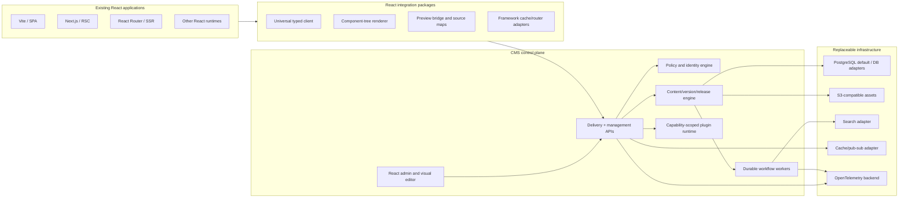

# React-first CMS framework: market research, complete feature map, and implementation plan

**Research date:** 17 July 2026  
**Document type:** Product architecture and delivery blueprint  
**Working product description:** A self-hostable, cloud-optional, React-native content operating system that can be added to an existing React application without taking over its renderer, router, hosting platform, database, or design system.

**Administration gap-analysis update:** 26 August 2026, GOV-006. The feature catalog below is the product vision, not a checklist of shipped behavior. The [CMS administration gap analysis](docs/cms-admin-gap-analysis.md) compares the supplied cross-platform menu reference with source at `72fbc62`, maps all 13 categories and all 19 current Studio destinations, and identifies concrete missing product surfaces. The [current task queue](TASKS.md#current-administration-upgrade-queue--2026-08-26) contains CMS-001 through CMS-031; [ADR 0027](docs/adr/0027-cms-administration-information-architecture.md) is proposed pending per-slice implementation approval. Existing release-readiness no-go decisions are unchanged.

---

## 1. Executive decision

The opportunity is not to build one more headless CMS. The market already treats structured content, generated APIs, drafts, localization, permissions, preview, and asset management as baseline capabilities. The stronger opportunity is a CMS that treats a React codebase as a first-class, versioned editing surface while keeping content, schemas, components, deployment, and data portable.

The recommended product has five defining properties:

1. **Universal React compatibility.** The core client works with any React renderer. Thin adapters add framework-native preview, caching, routing, and server behavior for Next.js, Vite, React Router, TanStack Start, Astro React islands, Gatsby, Electron, and React Native/Expo.
2. **Code-owned components, editor-owned composition.** Developers register real React components and typed props. Editors compose only the components, slots, tokens, data sources, and actions that developers explicitly permit. The CMS never needs to generate unsafe production React code.
3. **One canonical schema intermediate representation.** Visual modeling and schema-as-code both compile to a portable manifest. Drift detection and generated, reversible migrations prevent the common divide between a friendly admin UI and a safe engineering workflow.
4. **Local-first and cloud-optional.** The same product runs as an embedded Node service, a sidecar/control-plane service, Docker/Kubernetes workloads, or a managed service. The content delivery SDK is independent from the admin deployment.
5. **No structural lock-in.** Content, schemas, assets, component manifests, workflows, permissions, audit history, and redirects have documented export formats and stable APIs. Standard database/storage/auth/search adapters keep deployment choices open.

The practical path is a focused **v1 GA in roughly 10–12 months with a 10–14 person product engineering team**, followed by collaboration, enterprise governance, AI, experimentation, and marketplace maturity over an additional 6–12 months. Attempting every feature in the first release would produce a broad but unreliable system; the roadmap below preserves the full vision while sequencing risk.

---

## 2. Research scope and evidence

This research compared current official documentation for Strapi, Payload, Sanity, Contentful, Storyblok, Directus, Builder.io, and WordPress, plus relevant W3C, OWASP, and OpenTelemetry standards.

### 2.1 What the market has established

| Capability | Evidence from current products | Implication |
|---|---|---|
| Visual content modeling and generated APIs | Strapi exposes a visual Content-Type Builder and instant APIs; Directus generates REST and GraphQL APIs from the underlying data model. | Modeling, validation, REST, GraphQL, and typed SDK generation are table stakes. |
| Drafts, versions, diffs, restoration, autosave, and scheduling | Payload documents versions, draft access, diffs, restore, autosave, and scheduled publishing; WordPress has revisions and autosave. | A serious CMS needs recoverability and an auditable content lifecycle from day one. |
| Granular access control | Payload supports collection, operation, document, and field access; Contentful supports allow-list roles and fine-grained policies. | RBAC alone is insufficient; the new system needs RBAC plus ABAC and field/locale/environment constraints. |
| Localization | Contentful and Payload offer field-level localization, fallback behavior, and locale-aware delivery. | Localization must be modeled in the core data/version/publishing system, not added later as a plugin. |
| Visual preview and click-to-edit | Storyblok, Builder.io, Payload, and Sanity support visual editing or live preview. | Real-time preview is expected, but the integration should be easier and more portable across React runtimes. |
| Release orchestration | Sanity supports multi-document content releases, scheduled releases, validation, preview perspectives, and layered future states. | Release bundles and time-travel previews are a meaningful differentiator over simple per-entry scheduling. |
| Workflow automation | Directus offers low-code flows; Payload provides persisted jobs, queues, schedules, tasks, and workflows. | Hooks alone are too fragile. A durable event and workflow runtime is required. |
| React-specific integrations | Storyblok provides separate client, SSR/static, and RSC exports; Sanity supplies framework-specific visual-editing layers; Payload installs inside supported Next.js versions. | Compatibility requires separate browser/server/RSC entry points and a framework adapter test matrix. |
| Extensibility | Directus supports extensions; Contentful has an app framework; Strapi has plugins; Builder and Storyblok register custom components. | A stable plugin SDK, permission model, UI slots, and isolation boundary are core platform features. |
| SaaS scale controls | Contentful and Sanity document rate, concurrency, size, attribute, environment, and plan-specific limits. | A competitive product should publish limits, offer backpressure, and allow customers to scale or self-host without a commercial ceiling. |

### 2.2 Market limitations and the opening they create

These limitations are a synthesis of the documented architectures and constraints, not a claim that every product has every weakness.

1. **Framework coupling or integration glue.** Payload's current installation is directly coupled to supported Next.js version ranges. Sanity's strongest Next.js integration abstracts several packages and framework mechanisms, while its generic integration is explicitly not drop-in. Storyblok has distinct client, SSR, and RSC exports, and static export does not support live editing. A new product can make the universal integration contract itself the primary product.
2. **Preview fragility.** Iframe preview commonly needs HTTPS, correct routes, allowed origins, secure draft tokens, CSP changes, postMessage handshakes, and framework-specific cache invalidation. This creates a large gap between “SDK installed” and “editors can safely preview every route.”
3. **Vendor-specific content and query lock-in.** Proprietary query languages, document shapes, component metadata, image URLs, environment semantics, and visual-editor annotations make migrations expensive even when JSON export exists.
4. **SaaS limits and price cliffs.** Contentful documents default delivery and management rate limits; Sanity documents plan-dependent attribute/listener limits and fixed query/mutation constraints. These limits are reasonable for shared infrastructure, but customers need predictable capacity, local development, bulk migration behavior, and a self-host path.
5. **Weak schema lifecycle.** Visual schema editors are friendly but can bypass normal code review. Code-only schemas are safe but exclude operators. Environment cloning does not necessarily reproduce all workflow/governance configuration; Contentful documents environment-specific limitations and cases where workflows are not copied. Schema branching, migrations, drift detection, and promotion need to be one coherent system.
6. **Content and page composition are split.** Traditional headless CMSs excel at structured entries. Visual builders excel at pages. Many teams then maintain two taxonomies, two preview paths, duplicated permissions, and custom mapping code.
7. **Component contracts are often shallow.** A component may be registered by name and prop fields, but advanced constraints—slots, nesting rules, token bindings, data dependencies, accessibility rules, responsive behavior, migrations, deprecation, and per-variant governance—are inconsistently modeled.
8. **Collaboration is frequently document-centric.** Presence, comments, versions, and locks exist, but safe field/block-level concurrent editing, branching, merge conflict handling, and release layering are not universal.
9. **Portability is incomplete.** Exporting entries is not the same as exporting a working system. A complete move also needs schemas, assets and derivatives, relations, users/role mappings, workflows, redirects, versions, schedules, webhooks, locales, slugs, component manifests, and audit evidence.
10. **Extension safety is uneven.** Plugins can run with broad process/database/UI authority. A compromised extension can become a tenant-wide or supply-chain problem unless capabilities, signatures, sandboxing, and audit controls are designed in.
11. **Editorial quality is fragmented.** SEO, accessibility, link integrity, reading level, brand terminology, legal rules, localization completeness, structured data, and performance budgets often live in separate plugins.
12. **AI is being added before governance.** AI writing/search features are appearing quickly, but provenance, approval, prompt/model policy, retrieval scope, cost control, redaction, evaluation, and human review are not consistently first-class.
13. **Multi-tenant and multi-brand behavior is commonly additive.** Tenant filters or plugins work, but isolation, per-tenant encryption keys, quotas, domains, themes, locales, workflows, and cross-tenant administration should be enforced in the kernel.
14. **Operational insight is thin for self-hosters.** CMS operators need traces, queue visibility, cache hit rates, webhook delivery logs, search indexing lag, release timing, slow queries, and tenant usage—not just application logs.

### 2.3 Product thesis

The winning product should combine the structured-content strength of a headless CMS, the composition experience of a visual builder, the developer control of a TypeScript framework, the workflow safety of an enterprise content platform, and the portability of an open protocol.

---

## 3. Product principles and non-negotiable invariants

1. **React is a consumer, not the server architecture.** No React framework is required to host the CMS.
2. **The application keeps control of rendering, routing, styling, and deployment.** The CMS supplies content, component trees, preview metadata, and optional helpers.
3. **Published delivery never executes editor-authored JavaScript.** Actions and data sources are registered capabilities with validated inputs.
4. **Schemas and component contracts are versioned artifacts.** Every breaking change has a migration or an explicit compatibility decision.
5. **Every write is attributable, authorized, validated, and auditable.** Authorization is enforced server-side even when the UI hides an action.
6. **Tenant scope is mandatory in storage, cache, events, search, assets, jobs, and telemetry.** It cannot depend on developers remembering a filter.
7. **Preview data cannot leak into published caches.** Preview sessions, tokens, cache namespaces, and response headers are isolated.
8. **APIs are stable before the admin UI is considered complete.** The product must remain automatable and replaceable.
9. **The happy path is one command; the architecture remains modular.** Simple installation cannot require a monolithic runtime.
10. **Accessibility is a property of both the admin tool and generated experiences.** Target WCAG 2.2 AA for the admin and follow W3C ATAG guidance for authoring assistance.
11. **AI proposes; policy and humans decide.** AI output is labeled, reviewable, reversible, scoped, and never silently published.
12. **No “unlimited” claims.** Publish tested limits, benchmark methods, capacity guidance, and degradation behavior.

---

## 4. Target users and key jobs

| Persona | Primary job |
|---|---|
| React developer | Add CMS editing without rewriting routing, components, state, or deployment. |
| Platform engineer | Run one secure CMS platform across many apps, tenants, environments, and regions. |
| Content editor | Create and update content with previews, autosave, guidance, and no fear of breaking layouts. |
| Designer/design-system owner | Expose approved components, variants, tokens, slots, and responsive rules without losing governance. |
| Marketing/growth team | Launch pages, campaigns, personalization, experiments, redirects, and scheduled releases safely. |
| Localization team | Translate in parallel with context, terminology, fallback, QA, and locale-specific publishing. |
| Legal/compliance approver | Review exact changes, record approvals, enforce retention, and retrieve audit evidence. |
| Agency | Reuse blueprints and plugins across clients while preserving strict tenant isolation and easy handoff. |
| Product/content operations | Model reusable knowledge, orchestrate releases, measure content health, and automate repetitive work. |

---

## 5. Complete feature catalog

Priority codes: **P0** = required for a credible v1 GA, **P1** = next competitive layer, **P2** = advanced differentiation/marketplace expansion.

### 5.1 Installation and project onboarding

- **P0** `npx react-cms init` detects package manager, TypeScript, React/runtime, router, rendering mode, environment-file conventions, and monorepo layout.
- **P0** New-project starters for standalone CMS, existing React app, monorepo, Docker, and managed control plane.
- **P0** Non-destructive initializer with preview, dry-run, file-by-file confirmation, and uninstall manifest.
- **P0** Package-manager support for npm, pnpm, Yarn, and Bun where the runtime passes certification.
- **P0** ESM-first packages with documented CJS bridge where practical; tree-shakable, side-effect metadata, and explicit browser/server/RSC exports.
- **P0** Environment doctor for URLs, CORS/CSP, cookies, database, storage, email, webhooks, and preview handshake.
- **P0** Interactive setup wizard and headless flags for CI.
- **P0** Generated `.env.example`, Docker Compose development stack, seed content, and sample component registry.
- **P0** Existing-project codemods for provider, preview endpoint, route integration, and cache invalidation.
- **P0** Version compatibility checker and upgrade assistant.
- **P1** Zero-downtime blue/green upgrade workflow with schema compatibility verification.
- **P1** Cloud deployment presets for containers, Kubernetes, serverless API plus workers, and edge delivery.
- **P1** Monorepo/Nx/Turborepo workspace integration and package-boundary checks.
- **P2** Interactive import onboarding from major CMS platforms.

### 5.2 React-native developer experience

- **P0** Typed client with query keys, pagination, preview perspective, locale, tenant, and depth controls.
- **P0** Hooks for entry/query/live query, suspense and non-suspense modes, optimistic mutation, and paginated/infinite data.
- **P0** Components for rich text, responsive assets, portable links, component trees, boundaries, and missing-component fallback.
- **P0** Server API for SSR/SSG/RSC loaders that does not pull browser code into server bundles.
- **P0** AbortSignal support, request deduplication, batching, persisted queries, and retry/backoff.
- **P0** React Error Boundary integration with safe production fallbacks.
- **P0** Generated TypeScript types and query helpers from the canonical schema.
- **P0** Framework-neutral cache tags and invalidation events.
- **P0** React Strict Mode compatibility and no reliance on legacy context/lifecycles.
- **P0** CSP-compatible runtime with no `eval` or dynamic remote code execution.
- **P0** Design-system-first rendering: CMS runtime adds no required global CSS.
- **P0** Hydration-stable output and deterministic component keys.
- **P1** React Server Components-safe component manifest split between server, client, and universal components.
- **P1** Streaming/Suspense and partial prerendering adapters.
- **P1** Offline query cache and content bundles for React Native/Expo/Electron.
- **P1** Dev overlay showing content source, version, locale, cache state, and component contract problems.
- **P2** Visual component registration inspector and automated prop-control recommendations.

### 5.3 Component registry and visual composition

- **P0** `defineCmsComponent()` contract with stable ID, display name, version, prop schema, defaults, preview examples, and renderer reference.
- **P0** JSON Schema-compatible prop definitions plus TypeScript/Zod/Valibot adapters.
- **P0** Component categories, icons, documentation, ownership, maturity, tags, and deprecation state.
- **P0** Named slots, min/max children, allowed parent/child rules, required slots, and nesting depth limits.
- **P0** Component variants, responsive settings, visibility conditions, and token-bound style controls.
- **P0** Design token ingestion from JSON/token packages and read-only/curated token exposure.
- **P0** Drag/drop, keyboard move, duplicate, wrap, group, multi-select, undo/redo, copy/paste, reusable symbols, and templates.
- **P0** Outline/layers tree, breadcrumbs, search, locked regions, device presets, zoom, and overflow diagnostics.
- **P0** Inline text editing where safe, with a form editor for complete/complex fields.
- **P0** Click-to-edit overlay that maps DOM elements to entry, field, block, slot, and locale.
- **P0** Real-time preview without saving, with explicit draft/published/release perspectives.
- **P0** Registered actions and data sources with validated parameters; no arbitrary editor-authored JavaScript.
- **P0** Component-level permissions and per-role visibility in the palette.
- **P0** Component validation and accessibility rules executed in editor, CI, and publish gates.
- **P1** Component migrations, version pinning, usage search, impact analysis, and automated safe upgrades.
- **P1** Cross-page symbols with controlled overrides and dependency graph.
- **P1** Breakpoint-aware composition rules without serializing raw CSS for every element.
- **P1** Content-aware empty/loading/error states and preview fixtures.
- **P1** Design comparison view and visual regression snapshot per component/page.
- **P1** Page variants for market, audience, experiment, and scheduled release.
- **P2** Figma/design-system connector through a plugin, with token/component mapping rather than screenshot-to-code output.
- **P2** Safe AI composition from the approved registry, followed by normal validation and approval.

### 5.4 Content modeling and schema lifecycle

- **P0** Collections, singletons/globals, reusable objects, blocks/unions, arrays, maps, relations, taxonomy, tree, and graph structures.
- **P0** Fields: string, rich text, number, decimal, boolean, date/time/time zone, enum, JSON, code, color, geo, slug, URL, email, reference, file/image/video, computed, encrypted, and custom plugin field.
- **P0** Required/optional, defaults, unique/indexed, min/max/regex, cross-field validation, async validation, conditional fields, and read-only/hidden properties.
- **P0** Stable schema and field IDs independent of display names.
- **P0** Canonical schema IR used by admin forms, database adapters, APIs, code generation, migrations, search, and import/export.
- **P0** Schema-as-code and visual modeler round-trip through the same IR.
- **P0** Generated migration plan with destructive-change detection, data backfill hooks, lock/estimate preview, rollback policy, and CI approval.
- **P0** Schema drift detection among source, deployed schema, database, and generated types.
- **P0** Draft schema branches/environments and controlled promotion.
- **P0** Referential integrity, on-delete policies, circular-reference detection, and relationship graph viewer.
- **P0** Computed and virtual fields with deterministic/cache declarations.
- **P0** Reusable validations, field groups, tabs, help text, examples, and conditional editor layout.
- **P1** Polymorphic relations, inverse relations, temporal validity, and immutable record types.
- **P1** Schema diff impact report: affected entries, APIs, components, queries, workflows, and search indexes.
- **P1** Deprecation windows and compatibility aliases for API fields.
- **P2** Federated/external content types backed by remote services without copying every record.

### 5.5 Authoring and collaboration

- **P0** Fast, accessible list/form editors with saved views, filters, sorting, columns, bulk actions, and keyboard shortcuts.
- **P0** Autosave, drafts, version history, field-aware diff, restore, duplicate, archive, and soft delete/trash.
- **P0** Rich text with semantic blocks, marks, tables, embeds, code, mentions, footnotes, custom elements, paste cleanup, and Markdown shortcuts.
- **P0** Reference picker with typeahead, preview, create-in-place, and permission-aware results.
- **P0** Contextual validation with publish-blocking errors and non-blocking warnings.
- **P0** Comments, mentions, assignments, due dates, notifications, and resolved threads tied to entry/field/block.
- **P0** Presence and soft editing indicators.
- **P0** Compare draft, published, prior version, locale, environment, and release state.
- **P0** Content dependencies and “where used” graph before update/delete.
- **P0** Bulk edit, bulk publish/unpublish, import, export, archive, locale operations, and progress reporting.
- **P1** Field/block-level concurrent editing using a CRDT-compatible operation model.
- **P1** Suggestion/track-changes mode and reviewer accept/reject.
- **P1** Personal drafts or content branches with merge, conflict detection, and conflict UI.
- **P1** Editorial calendar, workload board, campaign view, and reusable checklists.
- **P1** Content templates, snippets, reusable fragments, and governed duplication.
- **P2** Offline authoring with secure local queue and conflict reconciliation.

### 5.6 Workflow, releases, and automation

- **P0** Custom states and transitions; default Draft → In review → Approved → Scheduled/Published → Archived.
- **P0** Transition permissions, required reviewers, separation of duties, and field/locale-specific approval rules.
- **P0** Scheduled publish, unpublish, archive, and embargo with tenant time zone and DST-safe behavior.
- **P0** Atomic multi-entry release bundles with validation and readiness status.
- **P0** Future-state/release preview including routes, redirects, references, menus, and assets.
- **P0** Durable jobs, queues, retries, exponential backoff, dead-letter queue, idempotency keys, timeouts, cancellation, and concurrency controls.
- **P0** Event triggers for content, schema, user, asset, workflow, release, webhook, and schedule events.
- **P0** Workflow steps: condition, transform, HTTP request, queue task, email/notification, approval, delay, script sandbox, AI task, and plugin action.
- **P0** Webhook signatures, replay protection, retry logs, manual redelivery, filters, transformations, and secret rotation.
- **P0** Transactional outbox so database commits and events cannot silently diverge.
- **P1** Visual workflow designer with versioning, testing, simulation, secrets redaction, and environment promotion.
- **P1** Release dependencies, freeze windows, rollback release, and partial failure policy.
- **P1** Service-level targets/escalations for approvals and localization.
- **P1** Inbound webhook/event ingestion with schema validation and deduplication.
- **P2** Cross-instance content release federation.

### 5.7 Localization and regional content

- **P0** Field-, object-, block-, entry-, route-, slug-, and asset-metadata localization policies.
- **P0** BCP 47 locale identifiers, locale fallback graph, default locale, and market variants.
- **P0** Per-locale draft/publish/schedule/workflow state.
- **P0** Side-by-side and matrix editing with source context and synchronized preview.
- **P0** Translation completeness, stale-source detection, untranslated/partially translated states, and fallback visibility.
- **P0** Locale-aware unique slugs, routes, redirects, search, SEO metadata, and sitemap generation.
- **P0** RTL interface/preview support and locale-specific typography/date/number examples.
- **P0** XLIFF/JSON/CSV import and export with stable IDs.
- **P0** Translation memory/terminology adapter interface.
- **P1** Machine translation proposals with glossary, protected terms, cost limits, provenance, and human approval.
- **P1** Vendor assignment packages and translation service connectors.
- **P1** Market inheritance: global → region → country → audience overrides with clear resolution tracing.
- **P2** Regional data residency routing and tenant/locale storage policies.

### 5.8 Digital asset management

- **P0** Folderless metadata/tags/collections plus optional virtual folders.
- **P0** Upload, drag/drop, remote import, duplicate detection, checksum, metadata extraction, and usage references.
- **P0** Image crop, focal point, rotate, format/quality transformation, responsive sizes, AVIF/WebP, and signed/private delivery.
- **P0** Alt text, caption, credit, rights, license, expiry, consent/model release, and locale-aware metadata.
- **P0** Asset versions and replace-without-breaking-references.
- **P0** Direct multipart/resumable upload to object storage.
- **P0** MIME/content verification, extension allow-list, size/pixel limits, decompression-bomb defense, malware scan hook, quarantine, and SVG sanitization.
- **P0** Storage adapters for local development and S3-compatible object storage; pluggable CDN/image services.
- **P0** Video/audio metadata, poster, captions/subtitles, transcript, and external streaming provider references.
- **P0** Broken/unused/expiring asset reports.
- **P1** AI-assisted tagging/alt-text/transcription with review and provenance.
- **P1** Asset approval workflow, rights territory, and expiry-based unpublish/replacement.
- **P1** Rendition presets controlled by design-system usage rather than arbitrary editor dimensions.
- **P2** External DAM federation and bidirectional metadata sync.

### 5.9 APIs, query, delivery, and real-time updates

- **P0** REST and GraphQL content delivery and management APIs generated from the same authorization-aware schema.
- **P0** Local server API for low-latency same-process use without bypassing authorization by default.
- **P0** Filter, sort, cursor pagination, projection, relation traversal, full-text query, locale, perspective, and version/release selectors.
- **P0** Persisted/allow-listed production queries and complexity/depth/cost controls.
- **P0** Optimistic concurrency using revision/ETag and explicit conflict responses.
- **P0** Content source maps from response fields/blocks to editor locations.
- **P0** WebSocket or Server-Sent Events live query protocol with resume cursor and tenant/authorization enforcement.
- **P0** CDN-safe published API, surrogate/cache tags, stale-while-revalidate, conditional requests, and webhook/event invalidation.
- **P0** SDK retry/backoff and published rate/size/concurrency limits.
- **P0** OpenAPI 3.1 and GraphQL schema publication; JSON Schema-compatible content/component contracts.
- **P0** API versioning, deprecation headers, changelog, and contract tests.
- **P0** Idempotent management mutations and bulk asynchronous operations.
- **P1** Content bundle/export endpoint for offline/mobile/static builds.
- **P1** Delta/sync API with checkpoint token for mobile, search, and downstream systems.
- **P1** Federated GraphQL/subgraph and external data source resolvers.
- **P1** Edge read replicas and region-aware routing.
- **P2** Event-sourced public change feed with configurable retention.

### 5.10 Search, taxonomy, knowledge, and discovery

- **P0** Admin full-text search across entries, fields, assets, users, comments, and schema.
- **P0** Pluggable search adapter with database fallback and official OpenSearch/Elasticsearch adapter.
- **P0** Search schema mapping, analyzers, synonyms, stop words, typo tolerance, facets, locale analyzers, and ranking configuration.
- **P0** Asynchronous indexing with status, retry, replay, lag, and rebuild tools.
- **P0** Hierarchical and faceted taxonomies, aliases, redirects, merge, and governance.
- **P0** Related-content and backlinks graph.
- **P1** Semantic/vector search with per-field inclusion, tenant isolation, provenance, and re-embedding jobs.
- **P1** Duplicate/near-duplicate content detection.
- **P1** Knowledge graph view and entity relationship exploration.
- **P2** Hybrid lexical/semantic recommendations with explainable ranking.

### 5.11 SEO, accessibility, and content quality

- **P0** SEO field group: title, description, canonical, robots, social image/text, structured-data references, and hreflang.
- **P0** Route/slug uniqueness, redirect manager, redirect chains/loops, and historical slug auto-redirect.
- **P0** Sitemap, robots, RSS/Atom/feed helpers, and structured data renderer.
- **P0** Link checker for internal, external, anchor, asset, and future-release links.
- **P0** WCAG-oriented checks: missing/poor alt text, heading order, link purpose, table headers, caption/transcript state, color token contrast, and landmark/component rules.
- **P0** Content lint rules for length, reading level, terminology, prohibited/required phrases, casing, and locale rules.
- **P0** Quality score with explainable findings; no opaque single score as the only signal.
- **P0** Publish gates configurable by content type, channel, locale, role, and severity.
- **P1** Preview performance budget checks for image weight, component count, and Core Web Vitals lab signals.
- **P1** Schema.org validation and reusable structured-data models.
- **P1** Legal/regulatory rule packs supplied by customer plugins rather than hard-coded claims of compliance.
- **P2** Site crawler that maps orphan pages, duplicate metadata, broken journeys, and stale content.

### 5.12 Personalization, targeting, and experimentation

- **P1** Audience/segment model with consent-aware attributes and external CDP adapter.
- **P1** Rule-based variants by locale, market, device class, referral/campaign, authentication state, and application-provided traits.
- **P1** Deterministic server/client assignment with sticky IDs and no layout flash.
- **P1** Experiment lifecycle: hypothesis, variants, allocation, metrics contract, start/stop, guardrails, result link, and winner promotion.
- **P1** Preview as an audience/variant without impersonating protected users.
- **P1** Edge-compatible decision API and cache-key guidance.
- **P1** Consent purpose and data minimization constraints on every targeting attribute.
- **P2** Multi-armed bandit plugin and external experimentation connectors.
- **P2** Content recommendations with explainability and holdout groups.

### 5.13 Analytics and content intelligence

- **P1** Analytics provider interface and normalized content/component impression/action events.
- **P1** Page/component/content performance dashboard with environment, locale, audience, and release dimensions.
- **P1** Content lifecycle metrics: time to publish, review bottlenecks, stale content, translation lag, reuse, and failed releases.
- **P1** Privacy-preserving aggregation and configurable retention.
- **P1** UTM/campaign governance and link builder.
- **P1** Release annotations pushed to analytics/observability providers.
- **P2** Attribution and content ROI connectors; the CMS should not pretend to be a full product analytics warehouse.

### 5.14 AI capabilities with governance

- **P1** Provider/model gateway so no CMS domain logic depends on one model vendor.
- **P1** Role- and field-scoped AI actions: summarize, rewrite, expand, translate, classify, extract, generate metadata, and propose component compositions.
- **P1** Retrieval limited by tenant, environment, locale, content permissions, and approved source sets.
- **P1** Prompt/template registry with owner, version, test set, allowed models, cost ceiling, and output schema.
- **P1** Structured outputs validated before entering fields.
- **P1** Provenance: model, prompt version, source references, actor, timestamp, cost/tokens, and subsequent human edits.
- **P1** Sensitive-data detection/redaction and “never send externally” fields/types.
- **P1** Human review required by policy before publish; generated content is visibly labeled.
- **P1** Evaluation suite for factuality proxies, policy violations, tone, localization, and regression.
- **P1** Budget, rate, timeout, fallback, and kill switches per tenant.
- **P2** Agentic content operations in a sandboxed, preview-first plan/approve/execute flow.
- **P2** RAG indexing and question-answering SDK with citations back to immutable content versions.

### 5.15 Users, organizations, multi-site, and multi-tenancy

- **P0** Organizations, tenants, workspaces/projects, sites/apps, environments, channels, brands, and locales as explicit scopes.
- **P0** Hard tenant isolation in storage/query/cache/search/assets/jobs/events/telemetry.
- **P0** Domain, route base, brand/theme token set, locale, workflow, and integration configuration per site.
- **P0** Shared global content with explicit publish-to-site and override/inheritance behavior.
- **P0** Tenant-aware quotas, rate limits, billing/usage events, and administrator dashboards.
- **P0** Tenant export/delete and cryptographic erasure strategy.
- **P1** Per-tenant encryption keys, storage buckets/prefixes, regions, and search indexes.
- **P1** Delegated tenant administration and agency portfolio view.
- **P1** Blueprints that provision schema, components, workflows, roles, locales, and starter content.
- **P2** Cross-organization content syndication with contractual source/version attribution.

### 5.16 Identity, authorization, security, and compliance controls

- **P0** Local development identity plus production OIDC/OAuth 2.0 integration; optional password auth with secure defaults.
- **P0** MFA/WebAuthn support when local auth is enabled.
- **P0** RBAC plus ABAC policies for tenant, site, environment, content type, entry predicate, field, locale, workflow state, operation, and time window.
- **P0** Service accounts and scoped API tokens with expiry, rotation, last-used, IP/network policy hooks, and one-time secret display.
- **P0** Preview tokens that are short-lived, single-purpose, origin-bound, perspective/route scoped, revocable, and excluded from logs.
- **P0** Server-side authorization on every API, local API, search result, live subscription, asset URL, job action, and plugin capability.
- **P0** CSRF, CORS, CSP, XSS sanitization, secure cookies, session rotation/revocation, brute-force protection, and rate limiting.
- **P0** SSRF controls and egress allow-list for remote imports, webhooks, link checking, and workflow HTTP actions.
- **P0** Immutable/tamper-evident audit trail with actor, impersonation, before/after reference, request/correlation ID, policy decision, and export.
- **P0** Encryption in transit; envelope encryption adapter for sensitive fields and tenant keys.
- **P0** Secrets manager interface; secrets never exposed to editors, exports, logs, or client bundles.
- **P0** Plugin capability manifest, signature/provenance, dependency scan, UI isolation, server sandbox where supported, and explicit administrator grant.
- **P0** Secure backup/restore, point-in-time recovery guidance, disaster recovery runbook, and restore testing.
- **P0** OWASP ASVS-based security requirements and threat model; SAST, dependency, secret, container, IaC, and dynamic scanning in release gates.
- **P0** Security headers and safe defaults with a diagnostic report.
- **P1** SAML, SCIM provisioning/deprovisioning, group-to-role mapping, session policy, and break-glass accounts.
- **P1** Approval and audit support for GDPR/CCPA requests, retention/legal hold, consent metadata, and data residency; do not claim certification merely from features.
- **P1** Policy-as-code adapter and authorization decision logs.
- **P1** Supply-chain SBOM, signed artifacts, provenance attestations, reproducible builds, and vulnerability disclosure process.
- **P2** Customer-managed keys/HSM adapters and field-level bring-your-own-key policy.

### 5.17 Extensibility and marketplace

- **P0** Plugin SDK for fields, validators, admin panels, sidebar widgets, list columns, dashboard cards, workflows, storage, databases, auth, search, AI, analytics, and import/export.
- **P0** Typed lifecycle/events API with stable versioning and idempotency guidance.
- **P0** UI extension slots and design primitives that inherit admin accessibility and themes.
- **P0** Capability-scoped server APIs and tenant administrator consent.
- **P0** Plugin configuration schema, secrets declarations, migration hooks, health checks, and uninstall cleanup preview.
- **P0** Local plugin development, hot reload, test harness, and compatibility checker.
- **P1** Signed marketplace packages, automated security/quality review, compatibility range, support policy, verified publisher, and transparent permissions.
- **P1** Extension isolation using iframe/worker/process boundaries according to capability and deployment.
- **P1** Revenue/license hooks without making core functionality dependent on marketplace availability.
- **P2** Remote connector runtime for enterprise systems behind customer networks.

### 5.18 Import, export, migration, and portability

- **P0** Full logical export of schemas, entries, relations, locales, assets/metadata, component trees/manifests, redirects, workflows, schedules, roles/policy templates, webhooks without secrets, and configuration.
- **P0** Stable archive manifest with format version, checksums, dependency order, and validation report.
- **P0** Streaming/resumable import, dry-run, ID mapping, conflict policy, transforms, progress, retries, and rollback boundary.
- **P0** CSV/JSON/NDJSON import/export and media URL ingestion.
- **P0** Database backup is documented separately from portable logical export.
- **P0** CLI and API parity for migration operations.
- **P1** Official importers for Strapi, Contentful, Sanity, Storyblok, WordPress, Directus, and Payload, prioritized by demand.
- **P1** Source-to-target mapping UI with repeatable transformation recipes.
- **P1** Dual-run incremental sync and cutover validation for low-downtime migration.
- **P1** Site crawler/importer that separates content from presentation and requires human component mapping.
- **P2** Export to a static, dependency-free content bundle and read-only SDK for archival continuity.

### 5.19 Operations, observability, and administration

- **P0** Structured logs, metrics, and distributed traces using OpenTelemetry-compatible instrumentation.
- **P0** Health, readiness, liveness, build/version, dependency, and migration status endpoints.
- **P0** Dashboards for API latency/error/rate limit, cache hit ratio, database pools/slow queries, queue depth/age/failures, webhook delivery, indexing lag, storage, release jobs, and live connections.
- **P0** Correlation ID propagated across API, database, job, webhook, search, and plugin execution.
- **P0** Admin operation log and status page for imports, exports, bulk actions, migrations, reindex, and releases.
- **P0** Graceful shutdown, worker draining, idempotent restart, and rolling deployment compatibility.
- **P0** Configurable retention/compaction for versions, audit, jobs, events, and telemetry.
- **P0** Backups, restore verification, disaster recovery objectives, and capacity guidance.
- **P0** Published benchmark harness and tested operating limits.
- **P1** Multi-region read replicas, regional job routing, failover, and consistency indicators.
- **P1** Cost/usage attribution by tenant, API token, workflow, AI model, storage, and delivery.
- **P1** Automated anomaly alerts and safe circuit breakers for failing connectors.
- **P2** Control-plane fleet management for many self-hosted instances without access to customer content by default.

### 5.20 Administration and product experience

- **P0** Customizable dashboard, recent work, assigned reviews, scheduled releases, failed automations, and content health.
- **P0** Global command palette and permission-aware navigation.
- **P0** Light/dark/high-contrast themes, reduced motion, keyboard navigation, screen-reader support, and accessible data grids/forms.
- **P0** User preferences for locale, time zone, density, notifications, and saved views.
- **P0** In-product documentation linked to schema/component ownership and support contacts.
- **P0** Feature flags and gradual rollout per tenant/environment.
- **P0** Impersonation only with explicit privilege, reason, visible banner, expiry, and audit trail.
- **P1** Mobile-responsive approval and lightweight editing experience.
- **P1** Custom branding, navigation, help links, and domain without forking admin code.
- **P1** Administrator adoption, active user, workflow, and license/usage dashboards.

---

### 5.21 CMS administration and visitor-site management gap closure

This addition makes previously implicit administration jobs explicit. It does not replace the earlier catalog or claim the referenced features are already delivered.

- **P0** Task-oriented, permission-aware administration with stable destination identity, deep links/history, dirty-state guards and exactly one current leaf/page. Retain all current advanced tools and global SCSS/accessibility contracts (CMS-001 through CMS-003).
- **P0** Generic registered-type authoring, entry list/filter/sort/pagination, factual dashboard summaries and clear schema/taxonomy inspection. Code-owned definitions must not be presented as mutable runtime models (CMS-004 through CMS-010).
- **P0** Visitor navigation as named, ordered, bounded hierarchical link content: header/footer assignments, stable IDs, scoped entry references, safe external links, locale behavior, immutable draft/published state, future-release validation and published-only app-owned rendering (CMS-011). This is separate from the Studio sidebar.
- **P0** Explicitly scoped revisioned site settings for branding, canonical origin, timezone, home/listing/privacy references and editorial defaults, with enforced singleton identity and public-field allowlists. Operational settings, secrets, DNS/TLS and topology provisioning remain distinct (CMS-010, CMS-012).
- **P0** Complete SEO data-to-output workflow, durable redirect management and published sitemap/robots/feed helpers. Existing quality checks and configured redirects are foundations, not complete delivery (CMS-013 through CMS-015).
- **P0** Focused people/access, installed-extension lifecycle, bounded analytics, logical archive utilities, health/help and private editorial inbox surfaces, reusing current services and honest provider boundaries (CMS-016 through CMS-022).
- **P0** Defined unpublish/archive/trash/restore semantics before bulk operations; reviewed model/taxonomy proposals and governed versioned design overrides without source execution (CMS-023 through CMS-026).
- **P1 / decision-gated** Live model/term activation requires a separate source-of-truth, generated-types, migration and multi-process coherence decision; source-reviewed proposals remain the default (CMS-027).
- **Optional / decision-gated** Commerce, finance/booking/subscription integrations, outbound marketing, forms/CRM/search-provider connectors, public comments/reviews and visitor memberships require explicit product/provider choices. Existing content models, CTAs, targeting and editorial/workforce identity are not those business systems (CMS-028 through CMS-030).
- **Excluded from this upgrade** Raw theme/plugin/file editors, arbitrary custom-code injection, native checkout/accounting/CRM engines, browser-triggered production restore or automatic core updates. Use reviewed application code, provider adapters and operator runbooks.

Target navigation and exact existing-to-new placement are in the [gap-analysis menu map](docs/cms-admin-gap-analysis.md#6-proposed-information-architecture). New leaves appear only when shipped/configured/permitted; a familiar label must never front a nonfunctional feature.

---

## 6. Reference architecture

### 6.1 System shape



### 6.2 Deployment modes

| Mode | Use | Trade-off |
|---|---|---|
| Standalone control plane | Default and most portable. React apps call an external API. | One additional service, but independent upgrades and framework compatibility. |
| Monorepo sidecar | CMS and app share a repository/deployment project but remain separate processes. | Excellent local DX; must coordinate deploy health and environment config. |
| Embedded Node adapter | CMS mounts into an existing compatible Node server. | Lowest call latency; host runtime and dependency conflicts require a narrow support contract. |
| Managed control plane | Vendor operates API/admin/workers; customer hosts the React app. | Fastest operations, but portability and export must remain identical. |
| Edge delivery plus regional control plane | Read API/cache at edge; writes/workflows stay regional. | Best global reads; consistency and invalidation become more complex. |

**Recommendation:** build and certify standalone mode first. Treat embedded mode as an adapter, not the foundational architecture.

### 6.3 Package layout

```text
@react-cms/schema          Canonical IR, validation, diff, migration contracts
@react-cms/core            Domain services, events, errors, capability model
@react-cms/server          HTTP/runtime composition without a React framework
@react-cms/admin           Accessible admin application and extension slots
@react-cms/editor          Component/page editor primitives
@react-cms/client          Framework-neutral typed browser/server client
@react-cms/react           Hooks, providers, component renderer, rich content
@react-cms/preview         Handshake, overlays, source maps, perspective support
@react-cms/next            Next.js cache, route, RSC, and preview adapters
@react-cms/react-router    Loader/action/router and preview adapter
@react-cms/vite            Development proxy, preview, and build integration
@react-cms/tanstack        TanStack Start adapter
@react-cms/native          React Native/Expo content renderer and offline bundles
@react-cms/cli             init, dev, doctor, generate, migrate, import/export
@react-cms/plugin-sdk      Capability-scoped extension contracts and test harness
@react-cms/db-postgres     Production reference database adapter
@react-cms/db-sqlite       Local development and small installation adapter
@react-cms/storage-s3      S3-compatible asset adapter
@react-cms/search-opensearch Official scalable search adapter
@react-cms/otel            Metrics/traces/log correlation and conventions
```

Packages must expose deliberate entry points such as `/browser`, `/server`, `/rsc`, and `/types`. CI must fail if a server-only dependency enters browser/RSC client bundles.

### 6.4 Canonical schema and data model

Use a canonical, versioned schema IR as the source of truth. TypeScript DSLs, visual-modeler changes, JSON Schema export, database migrations, admin forms, APIs, search mappings, and generated SDK types all compile to or from this IR.

Core records:

- `organization`, `tenant`, `workspace`, `site`, `environment`, `channel`, `locale`
- `schema_version`, `content_type`, `field_definition`, `component_manifest`, `migration`
- `entry_identity` (stable logical ID) and `entry_revision` (immutable version payload)
- `draft_pointer`, `published_pointer`, `release_revision`, `release_item`
- `relation_edge`, `route`, `redirect`, `taxonomy_term`
- `asset_identity`, `asset_revision`, `asset_rendition`, `asset_usage`
- `workflow_definition`, `workflow_instance`, `approval`, `job`, `outbox_event`
- `user`, `group`, `role`, `policy`, `service_account`, `api_token`
- `comment`, `notification`, `audit_event`, `webhook_delivery`

Recommended PostgreSQL model:

- Normalized identity, tenancy, authorization, relations, routes, workflows, and audit tables.
- JSONB revision payloads validated against the canonical schema, allowing flexible content models without a table explosion.
- Selectively generated/indexed columns for common filter/sort/unique requirements.
- Row-level tenant defense in depth, while application authorization remains authoritative and testable across adapters.
- Immutable revisions plus pointers for draft/published/release perspectives.
- Transactional outbox for search, cache invalidation, webhooks, analytics, and live updates.

### 6.5 React component contract

Conceptual API:

```ts
export const Hero = defineCmsComponent({
  id: 'acme.hero',
  version: 3,
  component: () => import('./Hero'),
  props: {
    title: field.text({ required: true, maxLength: 90, inline: true }),
    image: field.asset({ accept: ['image/*'], requiredAlt: true }),
    tone: field.enum({ values: ['brand', 'neutral'], default: 'brand' }),
  },
  slots: {
    actions: slot({ accepts: ['acme.button'], max: 2 }),
  },
  tokens: {
    background: token.color({ allow: ['surface.*'] }),
  },
  rules: [requireHeadingOrder(), performanceBudget({ imageKb: 300 })],
  permissions: { use: 'page.compose' },
  migrate: { 2: migrateHeroV2ToV3 },
})
```

The build adapter emits a serializable manifest. The CMS admin imports only the manifest and preview bundle; the application owns the production component implementation. This avoids requiring the CMS server to compile or execute the customer's application.

### 6.6 Preview and click-to-edit protocol

1. Editor requests a short-lived preview session scoped to tenant, environment, site, route, locale, and perspective.
2. CMS opens the application's registered preview URL after an allow-listed-origin handshake.
3. The app resolves draft/release content using the scoped server token; the token is never placed in normal published URLs or logs.
4. Content responses include source-map metadata. The React renderer adds minimal stable data attributes only in preview mode.
5. The overlay maps a DOM target back to entry/field/block/slot and opens the correct editor.
6. Unsaved changes stream over an authenticated channel as patches; the app applies them to preview state without contaminating published caches.
7. Navigation events synchronize route and content panels. Cache headers force preview responses private/no-store.
8. CSP/HTTPS/origin diagnostics are included in `react-cms doctor`.

Provide two preview strategies:

- **Embedded iframe** for the full editor experience.
- **Standalone signed preview** for applications that disallow framing; click-to-edit opens the admin alongside or in a new window.

### 6.7 API strategy

- REST is the simplest universal and bulk-operation surface.
- GraphQL supports precise content composition but must enforce depth, complexity, result-size, timeout, and persisted-query rules.
- Local server API is optional and uses the same authorization/policy pipeline.
- Management writes require revision preconditions and idempotency keys.
- Published and preview APIs use different credentials, cache namespaces, and host/path policy.
- The delta API is the durable integration primitive for search, native/offline bundles, data warehouses, and migrations.
- OpenAPI, GraphQL schemas, TypeScript types, event schemas, and content archives are generated and versioned in CI.

### 6.8 Multi-tenant security boundary

Every request context must resolve:

```text
actor + tenant + workspace + environment + site/channel + locale + perspective + capabilities
```

That context is passed to database queries, relation resolution, cache keys/tags, search filters, asset paths/signatures, live subscriptions, background jobs, webhook payloads, audit events, and telemetry. Integration tests deliberately attempt cross-tenant access at every layer.

### 6.9 Plugin execution model

- Declarative UI fields/widgets run inside restricted extension slots and communicate through a typed bridge.
- Network/file/process/database capabilities are denied unless declared and granted.
- High-risk server plugins run in a worker/process/isolate where the deployment supports it.
- Plugins receive scoped domain APIs, not raw unrestricted database handles by default.
- Installation shows requested permissions and data scopes.
- Package provenance, signatures, SBOM, vulnerabilities, compatibility, migrations, and uninstall effects are checked before activation.

### 6.10 AI architecture

AI is a provider-neutral workflow capability, not a hidden service inside fields. The AI gateway applies tenant policy, model allow-lists, prompt versions, retrieval filters, PII rules, budgets, timeouts, structured-output validation, provenance, and evaluation. Outputs become suggestions or drafts and follow the same workflow as human changes.

---

## 7. Compatibility contract

### 7.1 Supported rendering patterns

| Pattern | v1 expectation |
|---|---|
| Client-side React SPA | Full delivery, preview, live updates, and visual editing. |
| SSR | Full server client, preview, cache headers, and hydration-safe rendering. |
| SSG/static export | Published builds and content-triggered rebuilds; standalone preview uses a dynamic preview server or secure client draft mode. |
| Incremental regeneration | Framework adapter maps content events to cache tags/routes. |
| React Server Components | Server-safe data and component manifest; explicit client boundaries for preview/editor interactivity. |
| Edge runtime | Read-only SDK with Web APIs and no Node-only dependencies; management/workers remain on full runtimes initially. |
| React Native/Expo | Typed content, rich-content/component mapping, offline bundles; DOM click-to-edit is not applicable. |
| Electron | Browser renderer plus local/remote control plane; document OS/file permissions explicitly isolated. |

### 7.2 Framework certification matrix

At each release, CI should test the current and previous supported major releases where their upstream support windows overlap:

- React and React DOM
- Vite SPA and SSR
- Next.js App Router/RSC and Pages Router where still supported
- React Router framework mode and SPA mode
- TanStack Start
- Astro with React islands
- Gatsby/static build
- Node LTS releases
- Chromium, Firefox, and WebKit browser suites
- PostgreSQL supported majors and S3-compatible storage test suites

Each fixture runs install, type-check, build, SSR/SSG render, preview handshake, click-to-edit, live update, locale, publish invalidation, production bundle scan, and upgrade tests. Compatibility is a release gate, not a documentation promise.

### 7.3 Public compatibility guarantees

- Core client follows semantic versioning and a documented deprecation window.
- Component/schema IDs remain stable across display-name changes.
- Export format supports at least the previous two major readers, with an upgrade tool.
- Event consumers can declare a schema version and receive compatibility transforms during the support window.
- Framework adapter compatibility may move faster than the core, so adapters are independently versioned.
- No required global CSS, router replacement, state manager, or hosting provider.

---

## 8. Implementation roadmap

Assumption: 10–14 dedicated people (7–9 engineers, 1 product designer, 1 product manager, 1 QA/SDET, and fractional security/DevOps/docs), with workstreams running in parallel. A smaller team should reduce scope, not compress quality gates.

### Current executable administration plan — August 2026

The original phases and staffing estimates below remain historical product-planning context. Completed milestone tasks prove their recorded bounded slices, not every aspirational catalog bullet. The source-backed administration queue now supplies missing acceptance-level work without resetting that history:

1. **Preserve/reorganize → addressable navigation → authorized context:** CMS-001 through CMS-003. Existing screens are stabilized before new ones depend on their location/scope behavior.
2. **Expose content and existing foundations:** CMS-004 through CMS-010. Explicit type selection precedes lists, dashboard and content-linked configuration.
3. **Website essentials:** CMS-011 through CMS-015. Menus and site settings precede canonical SEO/discovery output; redirects precede feed validation.
4. **Focused administration:** CMS-016 through CMS-022. Reuse current identity/plugins/analytics/portability/workflow services instead of rebuilding them.
5. **Governed depth:** CMS-023 through CMS-026. Retirement semantics precede bulk writes; model/design proposals stay versioned and reviewed.
6. **Optional decisions:** CMS-027 through CMS-030. Owner/provider and data-boundary choices must happen before implementation tasks are created for these programs.
7. **Acceptance:** CMS-031 verifies every shipped leaf and all original capability paths; optional programs and external release-readiness gates are not falsely marked complete.

Each task lists tier, dependencies, module fence, acceptance and exclusions in `TASKS.md`. T2/T3 requires a scoped implementation plan and approval. Start with **CMS-001** only when implementation resumes; do not start the entire program or introduce empty placeholder menus. No new completion dates or staffing commitments are inferred from the original roadmap.

### Phase 0 — Product RFCs and risk prototypes (Weeks 1–4)

Deliverables:

- Architecture decision records for schema IR, immutable revisions/perspectives, tenant boundary, plugin capabilities, preview protocol, database adapter contract, and deployment modes.
- Working spikes for Vite SPA, Next.js RSC, and React Router SSR using one universal client.
- Preview handshake/source-map proof of concept with no published-cache leakage.
- Component manifest proof with slots, tokens, RSC/client boundaries, and a version migration.
- PostgreSQL revision/relation/outbox prototype and benchmark harness.
- Threat model and abuse cases for preview, uploads, plugins, webhooks, multi-tenancy, and imports.
- Product glossary and 20 representative content models from marketing, docs, commerce, news, SaaS, and multi-brand sites.

Exit gates:

- One content query renders correctly in CSR, SSR, SSG, and RSC fixtures.
- One editor change reaches live preview and maps back through click-to-edit.
- Cross-tenant access tests fail closed across query, cache, asset, event, and live connection prototypes.
- Core package graph proves browser/server/RSC separation.

### Phase 1 — Kernel, schema, storage, and APIs (Weeks 5–12)

Deliverables:

- Repository, package boundaries, CI, release automation, coding standards, telemetry conventions, and feature flags.
- Canonical schema IR, validation, diff, migrations, generated TS/OpenAPI/GraphQL artifacts.
- PostgreSQL and SQLite adapters; tenancy, revisions, draft/published pointers, relations, routes, locales.
- Identity context, RBAC/ABAC policy engine, local dev auth, OIDC adapter foundation, service tokens.
- REST delivery/management APIs, cursor pagination, filtering/sorting/projection, concurrency control, idempotency.
- Transactional outbox, base job runner, cache interface, audit event foundation.
- CLI: init, dev, doctor, generate, migrate, seed, export/import skeleton.

Exit gates:

- All writes are authorized, validated, revisioned, audited, and emit outbox events.
- Schema change dry-run reports destructive operations and supports tested rollback policy.
- P95 simple published read target under 100 ms at the service boundary on the published benchmark profile, excluding internet latency; exact hardware/data profile is published.
- Tenant isolation/property tests and migration/recovery tests pass.

### Phase 2 — React SDK and universal integration (Weeks 9–18, overlaps Phase 1)

Deliverables:

- Universal client and React hooks/components with browser/server entry points.
- Component registry compiler, typed component-tree renderer, rich text, assets, links, and error/missing-component boundaries.
- Vite, Next.js, and React Router adapters; build-time manifest extraction and cache invalidation.
- Preview session service, source maps, overlay, route sync, live patches, iframe and standalone preview modes.
- Framework fixtures and bundle-boundary tests.
- Initializers/codemods and three complete example applications.

Exit gates:

- Existing sample apps integrate without changing their router, styling system, or production component implementations.
- Preview setup succeeds from a clean clone using documented commands and doctor diagnostics.
- No secret or server-only package appears in client bundles.
- Published and preview responses cannot share cache keys/tags.

### Phase 3 — Admin, content editor, and DAM essentials (Weeks 9–22)

Deliverables:

- Accessible admin shell, navigation, command palette, dashboards, list/form views, saved views, and bulk-operation framework.
- Schema-driven forms, rich text, references, validation, autosave, versions/diff/restore, trash/archive.
- Asset library, direct upload, metadata, crops/focal point, renditions, usage graph, and security scanning hooks.
- Comments, mentions, assignments, notifications, presence, and change comparison.
- Locale UI, fallback/completeness, locale preview, and import/export basics.
- WCAG 2.2 AA automated/manual testing program and ATAG-informed authoring assistance.

Exit gates:

- Keyboard/screen-reader critical journeys pass manual acceptance.
- Autosave/version recovery survives network loss and stale-revision conflicts.
- Malicious upload test corpus is rejected/quarantined as designed.
- Editors can create, translate, review, preview, publish, restore, and audit without CLI access.

### Phase 4 — Visual page composition (Weeks 17–28)

Deliverables:

- Component palette, layers, drag/drop plus keyboard movement, slots, nesting rules, tokens, variants, responsive preview, reusable symbols, undo/redo.
- Inline editing, form synchronization, click-to-edit, preview patches, component validation, permission-aware palette.
- Page/route model, navigation, redirect manager, SEO/accessibility/link checks, templates.
- Component version/migration/usage impact foundations.

Exit gates:

- Editor cannot construct an invalid tree or use unapproved props/tokens/actions.
- Production rendering uses the application's registered components and remains deterministic across SSR/hydration.
- Visual editor remains usable with 500-node representative pages; exact interaction performance budgets are recorded.
- All editing actions are keyboard-accessible or have an equivalent accessible form workflow.

### Phase 5 — Workflows, releases, automation, and search (Weeks 21–32)

Deliverables:

- Custom workflow states/transitions, approval rules, schedules, notifications, separation of duties.
- Atomic release bundles, future-state preview, validation, publish/unpublish, rollback policy.
- Durable jobs/queues/retries/dead letters, signed webhooks, delivery logs, workflow actions.
- Search adapters, admin search, indexing pipeline/replay/status, taxonomy and backlinks.
- Bulk operations, logical export/import v1, operational dashboards.

Exit gates:

- Release failure cannot leave silently inconsistent state; atomicity/compensation semantics are documented and tested.
- Jobs and webhooks are idempotent under at-least-once delivery.
- Search can be fully rebuilt from the authoritative content event stream.
- Backup, restore, logical export, and disaster-recovery exercises pass.

### Phase 6 — Security hardening, beta, and v1 GA (Weeks 29–44)

Deliverables:

- OIDC production hardening, MFA for local auth, fine-grained policies, token lifecycle, secure session/preview controls.
- Plugin SDK v1 with capability grants, isolation path, test harness, signed package metadata.
- OpenTelemetry dashboards, rate limits, capacity guidance, retention, graceful rollout/worker drain.
- OWASP ASVS verification, external penetration test, dependency/container/IaC review, SBOM and artifact signing.
- Documentation site, migration guides, troubleshooting, runbooks, examples, accessibility statement, support policy.
- Private alpha → design partner beta → release candidate → GA, with measured upgrade rehearsals.

GA scope:

- Universal standalone control plane
- PostgreSQL production and SQLite local adapters
- Structured content, visual composition, DAM, localization
- Draft/version/preview/publish, approvals, schedules, release bundles
- REST, GraphQL, typed React SDK
- Vite, Next.js, and React Router certified adapters
- Multi-tenant foundation, OIDC, RBAC/ABAC, audit, secure plugins
- Search, webhooks, durable jobs, import/export, observability

Explicitly post-GA:

- Full CRDT collaboration and branch merging
- Advanced experimentation/personalization
- Enterprise SAML/SCIM/customer-managed keys
- Broad importer catalog and marketplace
- AI gateway and governed AI features
- Multi-region active/active control plane

### Phase 7 — Competitive expansion (Months 12–18)

- CRDT field/block collaboration, suggestions, branches, merge UI.
- Component migrations/deprecation/visual regression and deeper design-system tooling.
- SAML, SCIM, group sync, retention/legal hold, customer-managed key adapters.
- Official importers and dual-run migration tooling.
- Personalization, experimentation, analytics adapters, and edge decision API.
- Governed AI gateway, structured authoring actions, semantic search, evaluation/provenance.
- Marketplace verification/signing/review and external DAM/search/translation connectors.
- React Native/Expo offline content bundles.

### Phase 8 — Platform leadership (Months 18–24)

- Multi-region read/control-plane topology and regional residency.
- Federated content/data sources and cross-instance syndication.
- Advanced knowledge graph, recommendations, and agentic preview/approval workflows.
- Fleet management for self-hosted installations and enterprise operations.
- Public interoperability specification for schema/component/content archive and preview source maps.

---

## 9. Workstreams and team shape

| Workstream | Initial staffing | Responsibilities |
|---|---:|---|
| Kernel/data/API | 2–3 engineers | Schema IR, revisions, database, REST/GraphQL, policy, outbox, migration. |
| React/preview/editor | 2–3 engineers + designer | SDK, component registry, framework adapters, visual editor, preview/source maps. |
| Admin/workflow/DAM | 2 engineers + designer | Admin UX, authoring, assets, localization, releases, jobs, search. |
| Platform/security | 1–2 engineers + fractional security | Auth, tenant isolation, plugins, observability, deployment, supply chain, DR. |
| Quality/developer success | 1 SDET + 1 docs/DX engineer | Fixture matrix, E2E/performance/accessibility, CLI, examples, migration/docs. |
| Product | PM + tech lead/architect | Scope, RFCs, design partners, acceptance metrics, ecosystem. |

Staffing note: visual editing, schema migrations, multi-tenant authorization, and plugin isolation each deserve named owners. They are platform risks, not leftover implementation tasks.

---

## 10. Testing and quality strategy

### 10.1 Test layers

- Unit and property-based tests for schema parsing, migrations, policy decisions, route/locale resolution, component trees, and patch transforms.
- Contract suites every database, storage, cache, search, identity, AI, and analytics adapter must pass.
- API conformance tests generated from OpenAPI/GraphQL/event schemas.
- Integration tests with real PostgreSQL, object storage, cache/pub-sub, search, and OIDC provider in CI.
- Framework fixtures that install/build/render/preview/publish on every supported matrix entry.
- Browser E2E across Chromium, Firefox, and WebKit.
- Accessibility automation plus manual keyboard, screen reader, high contrast, zoom, RTL, and reduced-motion testing.
- Visual regression for admin/editor and representative registered components.
- Security tests for horizontal/vertical privilege escalation, tenant crossing, cache poisoning, CSRF/XSS/SSRF, upload corpus, preview leakage, token replay, webhook spoofing, plugin escape, and import bombs.
- Performance/load/soak/chaos for delivery reads, management writes, live connections, releases, indexing, jobs, webhooks, and large imports.
- Upgrade/downgrade compatibility, rolling deploy, migration interruption, backup restore, and disaster recovery drills.

### 10.2 Initial performance budgets

Budgets must be measured against published hardware/data profiles and refined during Phase 0:

- Published delivery API: p95 < 100 ms at service boundary for cached/simple reads; p99 and uncached targets published separately.
- Admin list first useful render: < 2.5 s on the defined mid-tier device/network profile.
- Form keystroke response: < 50 ms for normal fields; autosave never blocks typing.
- Visual editor selection/drag feedback: maintain 60 fps target for normal pages and usable degradation for the 500-node stress fixture.
- Preview update: p95 < 300 ms from accepted patch to visible local preview on the defined development profile.
- Webhook/event creation: durable before response completion; slow delivery is always asynchronous.
- Zero cross-tenant data exposure in security test suites.
- Zero known critical/high exploitable vulnerabilities at GA, with a published remediation policy.

### 10.3 Release gates

No GA release if any of these is missing:

- Threat model updated and security checks passed.
- Migration dry-run and rollback/forward-fix path tested.
- Framework compatibility matrix green.
- Backup restore and full logical export/import verified.
- Accessibility critical journeys accepted.
- Performance regression within budget.
- API/schema/event diffs reviewed for compatibility.
- SBOM, signatures/provenance, changelog, upgrade notes, and known limits published.

---

## 11. Success metrics

### Developer experience

- Median time from an existing supported React app to first editable component: under 15 minutes in usability tests.
- At least 90% of supported starter integrations complete without manual framework-specific debugging.
- No router, CSS framework, state manager, or hosting replacement required.
- Framework compatibility failures detected by CI before release.

### Editorial experience

- New trained editor can create, preview, submit, and schedule a page without developer help.
- Autosave recovery success > 99.99% for acknowledged edits in tested failure scenarios.
- Publish-blocking validation issues link directly to the responsible field/block and remediation.
- Median preview patch visibility under the defined 300 ms target.

### Platform quality

- Tenant isolation tests cover every adapter and asynchronous boundary.
- Search, cache, and downstream projections can be rebuilt from authoritative data/events.
- Restore and portable export/import are exercised before every major release.
- Webhook and job loss rate is zero for acknowledged durable events under the supported failure model.

### Ecosystem and portability

- A clean export can recreate a representative site—including schema, content, assets, relations, redirects, components, workflow definitions, and schedules—in a fresh instance.
- At least three independently maintained plugins pass the SDK conformance/security review before marketplace GA.

---

## 12. Major risks and mitigations

| Risk | Impact | Mitigation |
|---|---|---|
| “Any React project” becomes an untestable promise | High | Universal core plus narrow certified adapters; public compatibility matrix and fixtures. |
| Visual editor tries to become a full design tool | High | Expose approved components, slots, variants, tokens, and constraints; application remains renderer. |
| Visual and code schemas diverge | Critical | One canonical IR, drift detection, generated migrations, promotion workflow, stable IDs. |
| RSC/server/client code leaks across bundles | High | Explicit package exports, build graph checks, fixture bundle scans, serializable manifests. |
| Preview leaks drafts or secrets | Critical | Short-lived scoped sessions, private/no-store caching, separate credentials/namespaces, origin binding, tests. |
| Multi-tenant filter omission exposes data | Critical | Mandatory request context and adapter contract, defense-in-depth RLS, tenant-keyed infrastructure, adversarial tests. |
| Plugin ecosystem becomes a supply-chain/security problem | Critical | Capabilities, sandbox/isolation, signatures, SBOM, review, explicit grants, scoped APIs. |
| Schema migrations damage large datasets | Critical | Online migration patterns, dry-run estimates, backfills, compatibility phases, backups, rehearsals. |
| Realtime/CRDT complexity delays v1 | High | Ship presence, optimistic concurrency, versions, and soft indicators first; add full CRDT after kernel stability. |
| AI creates unsafe or untraceable content | High | Provider gateway, retrieval/policy scope, structured validation, provenance, evaluation, human approval, kill switch. |
| Too much scope produces mediocre essentials | Critical | Freeze the GA scope in Phase 0 and treat P1/P2 as post-GA unless a design partner displaces another item. |
| Self-hosting creates support fragmentation | Medium | Supported reference stack, conformance checks, `doctor`, deployment profiles, observable adapters, clear support boundaries. |
| Database abstraction lowers performance/correctness | High | PostgreSQL is the reference implementation; adapters pass strict contracts and may declare capability differences. |

---

## 13. Build, adopt, or defer

### Build as product-defining IP

- Canonical schema IR, schema lifecycle, migrations, and drift detection.
- React component registry/compiler and constrained composition model.
- Universal preview/source-map/click-to-edit protocol.
- Content versions/perspectives/releases and React delivery SDK.
- Tenant/policy context and capability-scoped plugin SDK.
- Portable logical archive and migration contracts.

### Adopt mature foundations behind adapters

- PostgreSQL and SQLite database engines.
- S3-compatible object storage and image/video processing libraries.
- OIDC/OAuth/SAML/SCIM libraries/providers.
- OpenSearch/Elasticsearch or hosted search providers.
- OpenTelemetry SDK/exporters.
- Rich-text editor primitives, drag/drop/accessibility utilities, and CRDT engine after evaluation.
- Malware scanning, email, CDN, analytics, translation, experimentation, and AI providers.

### Defer until the kernel is proven

- Full collaborative branching/merge.
- Active/active global writes.
- Proprietary analytics warehouse.
- Built-in commerce engine.
- Autonomous publishing agents.
- Hundreds of connectors maintained by the core team.

---

## 14. First 30 days: concrete execution checklist

1. Name a tech lead and owners for schema, React/preview, data/security, and editor UX.
2. Recruit 5–8 design partners representing Vite SPA, Next.js RSC, React Router SSR, multi-brand enterprise, and agency use cases.
3. Write the seven Phase 0 architecture RFCs and threat model.
4. Create the monorepo with package-boundary linting and three framework fixture apps.
5. Define the canonical schema IR v0 and 20 representative modeling fixtures.
6. Prototype immutable revisions/perspectives plus transactional outbox on PostgreSQL.
7. Prototype component manifest extraction and render the same content tree in CSR, SSR, SSG, and RSC.
8. Prototype preview session, live patch, source map, click-to-edit, and route synchronization.
9. Create the adapter conformance interface and first PostgreSQL/storage/cache contract suites.
10. Establish security, accessibility, performance, compatibility, and portability release gates before feature velocity obscures them.
11. Publish the product principles, non-goals, GA scope, terminology, and decision log internally.
12. Demo an end-to-end vertical slice: initialize existing app → register Hero → model Page → author → preview → approve → publish → invalidate cache → restore prior version → export.

That vertical slice is the correct first milestone. It tests the product's defining promise, not just isolated backend CRUD.

---

## 15. Recommendation

Proceed with the React-first CMS, but frame “most powerful” as **the most capable system that remains installable, portable, governable, and pleasant to operate**. Power is not the number of checkboxes. It is the ability to combine structured content, visual composition, React-native rendering, workflow, security, and extensibility without forcing a framework rewrite or creating a new lock-in.

The single most important early decision is the separation between:

- a framework-neutral CMS control plane,
- a stable content/component protocol,
- a universal React client/renderer, and
- independently versioned framework adapters.

If that boundary is correct, the product can grow into the full feature catalog. If it is wrong, every new React runtime, preview feature, deployment mode, and editor capability will multiply integration debt.

---

## 16. Primary research sources

- [Strapi 5 documentation: content modeling, content management, i18n, preview, and history](https://docs.strapi.io/)
- [Payload installation and current Next.js/runtime requirements](https://payloadcms.com/docs/getting-started/installation)
- [Payload versions, drafts, diffs, restore, autosave, and scheduling](https://payloadcms.com/docs/versions/overview)
- [Payload granular access control](https://payloadcms.com/docs/access-control/overview)
- [Payload live preview architecture](https://payloadcms.com/docs/live-preview)
- [Payload database adapters](https://payloadcms.com/docs/database/overview)
- [Payload durable jobs and workflows](https://payloadcms.com/docs/jobs-queue/overview)
- [Sanity visual editing overview and framework integrations](https://www.sanity.io/docs/visual-editing)
- [Sanity visual editing architecture](https://www.sanity.io/docs/visual-editing/visual-editing-architecture)
- [Sanity content releases](https://www.sanity.io/docs/studio/content-releases)
- [Sanity documented technical limits](https://www.sanity.io/docs/content-lake/technical-limits)
- [Contentful Content Delivery API and rate limits](https://www.contentful.com/developers/docs/references/content-delivery-api/overview/)
- [Contentful Content Management API and rate limits](https://www.contentful.com/developers/docs/references/content-management-api/overview/)
- [Contentful environments and documented limitations](https://www.contentful.com/developers/docs/concepts/multiple-environments/)
- [Contentful roles and fine-grained policies](https://www.contentful.com/developers/docs/references/content-management-api/roles/)
- [Contentful localization behavior](https://www.contentful.com/developers/docs/tutorials/general/setting-locales/)
- [Storyblok React SDK client/SSR/RSC modes](https://www.storyblok.com/docs/libraries/js/react-sdk)
- [Storyblok visual editor security and integration requirements](https://www.storyblok.com/docs/concepts/visual-editor.html)
- [Directus architecture, generated APIs, permissions, flows, and extensions](https://docs.directus.io/getting-started/architecture)
- [Directus Data Studio](https://docs.directus.io/user-guide/overview/data-studio-app)
- [Builder.io visual editor](https://www.builder.io/c/docs/visual-editor)
- [WordPress revisions and autosaves](https://wordpress.org/documentation/article/revisions/)
- [OWASP Application Security Verification Standard](https://owasp.org/www-project-application-security-verification-standard/)
- [W3C Web Content Accessibility Guidelines 2.2](https://www.w3.org/TR/WCAG22/)
- [W3C Authoring Tool Accessibility Guidelines overview](https://www.w3.org/WAI/standards-guidelines/atag/)
- [OpenTelemetry specification](https://opentelemetry.io/docs/specs/otel/)

