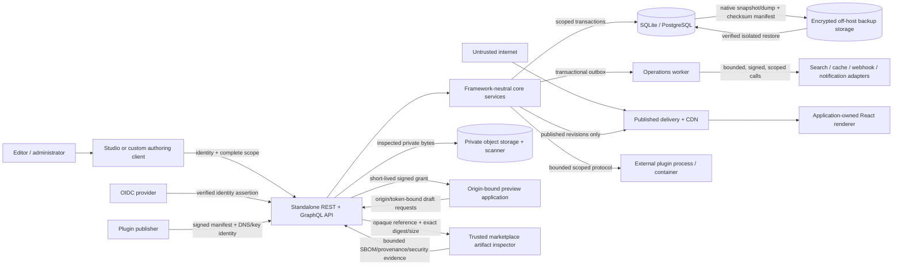

# GridStory threat model

This document is the reviewable view of the canonical machine-readable model in [`security/threat-model.json`](../../security/threat-model.json). It follows OWASP's four threat-modeling questions: what are we building, what can go wrong, what will we do, and did we do enough. STRIDE is a discovery aid, not the risk score. This model covers GridStory's current control plane, authoring, preview, assets, delivery, background operations, search, portability, recovery, plugin-runtime, operator-scoped marketplace, and consent-aware targeting boundaries.

This is a living engineering model. It is not a penetration-test report or a claim that a deployment is secure without its identity provider, TLS edge, secret manager, databases, object stores, egress controls, logging, and application-owned renderers being configured and reviewed.

## System and trust boundaries

The numbered boundaries in the canonical model are:

1. Public internet to API and delivery.
2. Authoring browser to management API.
3. Tenant scope to persistence, caches, and indexes.
4. Draft/preview to published delivery.
5. API to preview application.
6. API/worker to external adapters.
7. Upload client to private object storage.
8. Transactional write to asynchronous worker.
9. Logical archive to repository.
10. Control plane to signed plugin package and external runtime.
11. Database and recovery operator to protected backup storage.
12. Governance approval and worker to governed resources, KMS, and placement adapters.
13. Migration service to read-only external CMS sources and guarded target writes.
14. Authoring and anonymous applications to draft or published targeting decisions.

A change that crosses or weakens one of these boundaries requires a threat-model review in the same change.

## Security assets

The protected assets are draft history; published content and routes; complete tenant/locale scope; identities, roles, grants, and sessions; signing secrets and service credentials; private asset bytes and verdicts; workflow approvals and release intent; outbox/job state; audit history; search indexes and cache tags; logical archives; service capacity; plugin manifests, marketplace publisher/release evidence, tenant grants, and lifecycle evidence; and whole-database backups/recovery manifests.

Draft content, identity attributes, credentials/tokens, private assets, and operational/audit data are sensitive. Published content is intentionally public, but its integrity, freshness, route correctness, and tenant separation remain security properties.

## Risk method

Likelihood and impact use integer values from 1 to 5. Risk is `likelihood × impact`:

| Score | Rating | Required handling |
|---:|---|---|
| 17-25 | Critical | Do not release; remove or mitigate immediately. |
| 10-16 | High | Mitigate before the affected production capability ships, or record an explicit time-bounded acceptance by the security owner. |
| 5-9 | Medium | Assign an owner and target milestone; verify the compensating controls. |
| 1-4 | Low | Track and review when the boundary changes. |

Every modeled threat has a response, owner, concrete mitigations, and verification references. `security/threat-model.json` is validated automatically for those invariants.

## Priority threat register

| ID | Threat | STRIDE | Inherent risk | Current position / residual work |
|---|---|---|---:|---|
| THREAT-0001 | Cross-tenant object access or mutation | S/I/E | 20 Critical | M5-002 established canonical collision-safe scope contracts and fail-closed repository/adapter/queue/telemetry checks; production database and object-store policy conformance remains deployment evidence. |
| THREAT-0023 | Malicious, forged, over-granted, or escaped plugin | S/T/I/D/E | 20 Critical | M5-003 verifies signed digest-bound metadata, compatibility, constrained tenant grants, authorized lifecycle/revocation, and bounded external-runtime messages without importing plugin modules. M6-005 adds current approved marketplace-release revalidation and disabled/no-grant install handoff; OS/container hardening remains deployment evidence. |
| THREAT-0028 | Forged, stale, or overclaimed marketplace publisher identity | S/T/R/E | 20 Critical | Validated identity/key input, exact expiring DNS possession, distinct evidence-referenced human approval, private summaries, current-trust install checks, and immediate suspension mitigate the repository boundary. Business-legitimacy review and DNS operations remain operator evidence. |
| THREAT-0029 | Forged, stale, incomplete, or overtrusted marketplace release review | S/T/R/D/E | 20 Critical | A configured non-executing inspector must bind current inventory/SBOM/provenance/malware/vulnerability/license evidence to the exact signed artifact; unsafe/missing/error evidence blocks, another human approves, releases remain immutable/yankable, and UI/docs separate evidence from safety. Scanner transport, engine/policy, and evidence-store conformance remain deployment evidence. |
| THREAT-0030 | Personal-data overcollection, consent bypass, draft leakage, or targeting cache confusion | S/T/R/I/D/E | 20 Critical | Typed finite allowlists, purpose-specific consent/GPC gates, no profile/input persistence, private draft preview, exact published revision, deterministic fallback, and complete scope/revision/input cache keys fail closed. Customer consent/legal decisions, input provenance, CDN behavior, and purge operations remain deployment evidence. |
| THREAT-0024 | Database backup disclosure, tampering, or unsafe restore | T/I/D | 20 Critical | M5-005 adds native consistent backup formats, minimal SHA-256 manifests, integrity/table checks, credential-safe PostgreSQL invocation, absent/empty isolated restore targets, live SQLite and disposable PostgreSQL restore drills, and protected storage/PITR guidance. Provider storage, keys, retention, access logging, and physical PITR proof remain deployment evidence. |
| THREAT-0026 | CMS source credential disclosure, SSRF, hostile continuation, or source exhaustion | S/T/I/D/E | 20 Critical | Server-only read credentials, credential-free fixed HTTPS origins, disabled redirects, same-origin continuation, response/record bounds, strict normalization, private state, and mocked hostile adapter regressions mitigate the repository boundary. Egress policy, secret-manager lifecycle, provider logs/revocation, and production throttling remain deployment evidence. |
| THREAT-0027 | Migration drift, retry duplication, destructive reconciliation, or false cutover readiness | T/R/I/D/E | 20 Critical | Exact-effect dry-runs, digest/expiry/version/revision binding, pending links, checksum recovery, post-success checkpoints, normal content gates, non-destructive deletion blockers, full reconciliation, and an explicit content-only readiness claim fail closed. External traffic/application/SEO/analytics acceptance remains operator work. |
| THREAT-0007 | Malicious or mislabeled asset upload | T/D/E | 16 High | Descriptor matching, byte inspection, SVG sanitization, quarantine, and verified-only delivery exist; deployment quotas and scanner conformance remain. |
| THREAT-0010 | GraphQL/query complexity exhaustion | D | 16 High | Depth, aliases, field selections, body size, batching/subscriptions, shared query shapes, and application-pipeline budgets are bounded; the M5-008 review records deployment rate/concurrency and introspection policy as absent beta/RC evidence. |
| THREAT-0017 | Stored content script/markup execution | T/E | 16 High | Structured manifests and code-owned components constrain execution; every application renderer remains responsible for contextual encoding. |
| THREAT-0019 | Resource exhaustion and unbounded retention | D | 16 High | M5-004 adds saturation signals/telemetry retention; M5-007 adds body/upload/archive/query/job/plugin limits and SQLite/PostgreSQL regression budgets. The M5-008 review leaves deployment quotas/rates/concurrency no-go; product retention remains M6-003. |
| THREAT-0002 | Development identity exposed in production | S/E | 15 High | Production mode rejects actor/role/principal headers, backend-verifies opaque sessions, and tenant-binds SCIM credentials; trusted-proxy/TLS and live IdP deployment conformance remain explicit beta evidence. |
| THREAT-0004 | Draft content enters public cache | I/T | 15 High | Public delivery remains published-only; full-scope cache prefixes, scoped invalidator inputs, namespaced workflow tags, and cross-scope regressions are verified. |
| THREAT-0005 | Webhook SSRF or DNS rebinding | I/E | 15 High | HTTPS/public-host/no-redirect validation exists; production egress, allow-list, and DNS controls are required. |
| THREAT-0009 | Archive tampering or cross-scope import | T/E/D | 15 High | Checksums, versions, dry-run, scope checks, rollback, a 16 MiB body, and bounded entries/revisions/audit events are enforced before mutation. |
| THREAT-0012 | Search perspective or tenant bleed | I/T | 15 High | Adapter scope/perspective is checked, hits reload through scoped storage, hostile totals/facets are discarded, and identifier-only jobs remain enforced. |
| THREAT-0013 | Job scope confusion or duplicate effect | T/R/I | 15 High | Claimed/enqueued/replayed records and embedded webhook/cache inputs fail closed on scope mismatch; external receivers still require delivery-ID idempotency. |
| THREAT-0014 | Workflow/release policy bypass | T/R/E | 15 High | Distinct permissions, separation of duties, revision checks, atomic validation, and audit exist. |
| THREAT-0016 | Secret or service credential compromise | S/I/E | 15 High | Separate configurable secrets, hashing, expiry, and revocation exist; M5-004 excludes exporter headers/credentials from health and signals and adds exposure response, while vault-backed lifecycle and full rotation evidence remain. |
| THREAT-0018 | External adapter failure or compromise | T/I/D | 15 High | Search, asset, audit, cache, webhook, job, and telemetry interfaces carry explicit scope and validate returned data; M5-004 adds bounded Collector health, degradation alerts, retry/queue guidance, and failure isolation. Non-telemetry adapter conformance remains deployment evidence. |
| THREAT-0015 | Audit tampering, truncation, or log injection | T/R/I | 12 High | M5-004 keeps audit authoritative and separate while exporting fixed-body, bounded-attribute telemetry through a fail-closed Collector allow-list with access, retention, correlation, and incident policy. Backend append-only/deletion protection remains a deployment control. |
| THREAT-0022 | Sensitive error or debug disclosure | I | 12 High | Generic responses remain enforced; M5-004 removes detailed public readiness drift, excludes raw URLs/headers/bodies/error messages from OTLP, and verifies credentials/query strings do not reach live exports. Production debug-off validation remains deployment evidence. |
| THREAT-0020 | Dependency/build compromise | T/E | 15 High | M5-007 adds OSV/Dependabot policy, reviewed package inventories, SHA-256 verification, pinned SPDX generation, and GitHub/Sigstore provenance/SBOM workflows; M5-008 records hosted issuance/verification as unmet `RC-004`, so RC/GA remain no-go. |
| THREAT-0021 | Transport/proxy misconfiguration | S/I | 15 High | Explicit origin policy exists; TLS/proxy/deployment conformance is required before GA. |
| THREAT-0025 | Governance bypass, overbroad export, or irreversible deletion | S/T/R/I/D/E | 20 Critical | Explicit links, scoped permissions, hold/restriction dominance, exact plan digests, separate fresh approval, verified backup evidence, worker-time revalidation, narrow KMS/placement/processors, and receipts fail closed; customer discovery/legal decisions and production provider conformance remain external. |

The canonical register also covers preview and asset grant replay, forged webhooks, cursor tampering, audit/log attacks, and error disclosure.

## Security assumptions and non-goals

- Production TLS and least-privilege infrastructure are deployment requirements, not properties of the local HTTP development server.
- Development actor/role/scope headers and default local secrets must never be reachable from an untrusted network.
- Production identity repository tests do not certify a customer's IdP, reverse proxy, TLS termination, secret manager, or authenticator fleet; those deployment controls must be verified independently.
- GridStory validates structured content but cannot make arbitrary application-owned React code safe. Consuming applications own contextual output encoding, dependency review, and CSP compatibility.
- Provider adapters must preserve complete tenant scope and the documented timeout, redirect, credential, and failure behavior.
- Server plugin packages remain outside the control-plane process and execute only in operator-provided external processes/containers. GridStory verifies and mediates the protocol; operators own OS identity, filesystem, network, CPU, memory, and process isolation.
- M6-005 supplies scoped publisher enrollment and evidence-bound release review, but package bytes/download, scanner engines, publisher business-legitimacy checks, automated safety guarantees, and the Studio/runtime sandbox remain external. Provenance, a verified badge, or a passing scan does not prove safety.
- Whole-database backups contain every tenant and are never a tenant-scoped portability mechanism. Operators own encrypted off-host storage, key custody, retention/deletion, restore approvals, and provider-specific physical PITR evidence.
- Governance automation is not legal advice or automatic personal-data discovery. Operators own classifications, link completeness, lawful-basis/hold decisions, external-system processors, coordinated backups, provider KMS/placement evidence, and production approval policy.
- CMS source credentials are server-only, read-only, least privilege, and operator-managed. GridStory does not write to or decommission a source CMS, move binary media, or administer its credentials.
- A migration cutover report covers only the normalized content observed during that validation. It does not certify routes outside mapped schemas, binary assets, application behavior, SEO, analytics, identity, infrastructure, legal readiness, traffic switching, or source retirement.
- Targeting configuration is not a consent manager, customer profile store, legal interpretation, behavioral collector, or CDN. Applications own consent evidence, lawful use, source normalization, rendered-response isolation, and exact use/purge of shared cache keys.
- No threat is accepted merely because it is listed. Any residual high or critical risk needs a task or explicit, named, expiring acceptance.

## M6-003 evidence update

`THREAT-0025` adds the governance approval/worker-to-resource/KMS/placement boundary. The implemented mitigations use explicit subject links, distinct scoped permissions, legal-hold/restriction precedence, immutable dry-run candidates and digest, a different freshly authenticated approver, current backup evidence, execution-time revalidation, fail-closed processors and placement/key state, envelope encryption, idempotent receipts, and hash-chained events. Focused core/API/Studio/recovery/PostgreSQL evidence uses only isolated fixtures and mocked KMS clients.

Residual deployment risk remains high until the customer proves data discovery/classification, applicable policy, all external processors, object/provider backups, live KMS credentials/key policy/region, actual storage and support locations, and operational separation of duties. Configured placement is an attestation input, not routing or compliance certification.

## M6-004 evidence update

`THREAT-0026` adds the trusted runtime-to-external-CMS boundary, and `THREAT-0027` covers source/target drift, crash recovery, destructive reconciliation, and overclaimed cutover readiness. Contentful, Sanity, and WordPress transports use injected fetch implementations, credential-free fixed HTTPS origins, no redirects, same-origin pagination/continuation, bounded response bytes/records, strict response normalization, read-only methods, and redacted failures. Source credentials never enter migration documents, API summaries, Studio, or telemetry.

Versioned deterministic recipes and complete-scope private repositories retain projects, links, plans, runs, checkpoints, and reports. Execution requires the exact unexpired plan digest, project/recipe/source checksums, and expected target revision; it records a pending deterministic link before content mutation, recovers a checksum-identical partial write, advances the checkpoint only after every effect and receipt completes, and sends mutations through normal content/reference/workflow/quality/governance/publication checks. Source deletions, unpublishes, unsupported media, incomplete snapshots, and manual target changes block rather than delete or overwrite.

Residual production risk stays high until an operator proves least-privilege provider credentials and revocation, egress/DNS/rate/timeout policy, a coordinated database/provider/object/config backup, representative source fixtures and mapping acceptance, application/route/media/SEO/analytics/identity checks, and an independently controlled traffic rollback. The source remains authoritative until that external cutover is accepted; GridStory's report neither switches traffic nor certifies those systems.

## M6-005 evidence update

`THREAT-0028` covers deceptive/stale publisher identity, challenge replay, key substitution, self-approval, and continued trust after suspension. Publisher enrollment validates domains, same-domain ownership links, and Ed25519 public keys; short-lived exact-name TXT possession precedes a distinct evidence-referenced human approval, while suspension immediately removes marketplace trust. Catalog summaries omit challenges and public-key bodies, and every marketplace install revalidates publisher/key/signature state.

`THREAT-0029` covers mismatched, stale, incomplete, unavailable, compromised, or overtrusted inspection. The control plane never imports or executes the package and fails closed without an injected trusted inspector. Review binds exact digest/size and current inventory, SPDX, provenance subject, malware, vulnerability, license, inspector-version, and evidence-reference results; unsafe or missing checks block, capabilities remain warnings for human judgment, a distinct operator approves, releases are immutable/yankable, and approved installation remains disabled with no grants.

Residual deployment risk remains critical until an operator authenticates the scanner transport, validates scanner engines/policy/update/freshness and evidence-store integrity/retention, performs independent publisher due diligence, coordinates package/evidence recovery, and provisions least-privilege plugin runtime isolation. GridStory makes evidence reviewable; it does not certify third-party code as safe or guarantee publisher support.

## M7-001 evidence update

`THREAT-0030` adds the authoring/anonymous-application-to-targeting boundary. Configuration accepts only bounded boolean or finite-enum attributes with explicit source, classification, purposes, and cacheability; personal attributes require purposes and cannot be shared-cache inputs. Runtime calls reject unknown attributes, values, and purposes, do not persist inputs or profiles, make denied/missing consent fail closed, and apply GPC only to purposes configured to honor it.

Management and hypothetical preview require distinct scoped authorization and remain private/no-store. Publishing copies the exact optimistic draft revision. Anonymous evaluation reads only that published snapshot, evaluates unique-priority rules deterministically with a required fallback, omits raw values from explanations, and produces a complete shared key only when every possible input is bounded public and consent-independent. The POST response itself remains private/no-store.

Residual deployment risk remains critical until the customer validates notices, consent evidence and revocation, applicable legal treatment including GPC, upstream trait provenance/minimization, application rendering, edge/CDN cache configuration, purge behavior, rate controls, and any external CDP adapter. Repository evidence proves its contract against synthetic inputs, not lawful use or a production CDN.

## Review workflow

Review at least quarterly, before every release candidate, and whenever identity, authorization, tenant scope, caching, preview, assets, imports, jobs, logging, external adapters, deployment topology, or sensitive-data classification changes.

1. Update actors, assets, boundaries, flows, and assumptions in `security/threat-model.json`.
2. Add or amend stable `THREAT-####` records. Do not recycle identifiers.
3. Choose mitigate, eliminate, transfer, or accept; name the owner and verification evidence.
4. Link unresolved work to a stable `TASKS.md` item. A high/critical acceptance must name the approver and expiry in the threat record.
5. Update the ASVS profile and security requirements where the control set changes.
6. Run `pnpm security:check` and the proportionate tests. Review evidence, not only document shape.

A review is complete when the model is current, all threats have dispositions, high/critical residual work is owned, and the automated profile/model validation passes.
