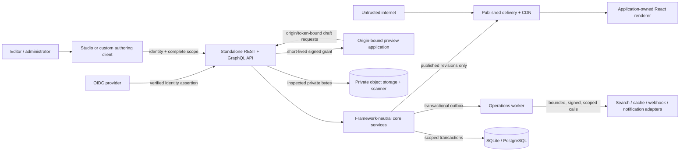

# GridStory threat model

This document is the reviewable view of the canonical machine-readable model in [`security/threat-model.json`](../../security/threat-model.json). It follows OWASP's four threat-modeling questions: what are we building, what can go wrong, what will we do, and did we do enough. STRIDE is a discovery aid, not the risk score. This model covers GridStory's current control plane, authoring, preview, assets, delivery, background operations, search, and portability boundaries.

This is a living engineering model. It is not a penetration-test report or a claim that a deployment is secure without its identity provider, TLS edge, secret manager, databases, object stores, egress controls, logging, and application-owned renderers being configured and reviewed.

## System and trust boundaries

The numbered boundaries in the canonical model are:

1. Public internet to API and delivery.
2. Authoring browser to management API.
3. Tenant scope to persistence, caches, and indexes.
4. Draft/preview to published delivery.
5. API to preview application.
6. API/worker to external adapters.
7. Upload client to private object storage.
8. Transactional write to asynchronous worker.
9. Logical archive to repository.

A change that crosses or weakens one of these boundaries requires a threat-model review in the same change.

## Security assets

The protected assets are draft history; published content and routes; complete tenant/locale scope; identities, roles, grants, and sessions; signing secrets and service credentials; private asset bytes and verdicts; workflow approvals and release intent; outbox/job state; audit history; search indexes and cache tags; logical archives; and service capacity.

Draft content, identity attributes, credentials/tokens, private assets, and operational/audit data are sensitive. Published content is intentionally public, but its integrity, freshness, route correctness, and tenant separation remain security properties.

## Risk method

Likelihood and impact use integer values from 1 to 5. Risk is `likelihood × impact`:

| Score | Rating | Required handling |
|---:|---|---|
| 17-25 | Critical | Do not release; remove or mitigate immediately. |
| 10-16 | High | Mitigate before the affected production capability ships, or record an explicit time-bounded acceptance by the security owner. |
| 5-9 | Medium | Assign an owner and target milestone; verify the compensating controls. |
| 1-4 | Low | Track and review when the boundary changes. |

Every modeled threat has a response, owner, concrete mitigations, and verification references. `security/threat-model.json` is validated automatically for those invariants.

## Priority threat register

| ID | Threat | STRIDE | Inherent risk | Current position / residual work |
|---|---|---|---:|---|
| THREAT-0001 | Cross-tenant object access or mutation | S/I/E | 20 Critical | Explicit scope and deny-by-default controls exist; M5-002 owns exhaustive cross-adapter and telemetry proof. |
| THREAT-0007 | Malicious or mislabeled asset upload | T/D/E | 16 High | Descriptor matching, byte inspection, SVG sanitization, quarantine, and verified-only delivery exist; deployment quotas and scanner conformance remain. |
| THREAT-0010 | GraphQL/query complexity exhaustion | D | 16 High | Depth and data-shape bounds exist; cost, alias, rate, and benchmark-backed limits remain in M5-007. |
| THREAT-0017 | Stored content script/markup execution | T/E | 16 High | Structured manifests and code-owned components constrain execution; every application renderer remains responsible for contextual encoding. |
| THREAT-0019 | Resource exhaustion and unbounded retention | D | 16 High | Several local bounds exist; published limits, quotas, capacity telemetry, and retention remain in M5-004/M5-007. |
| THREAT-0002 | Development identity exposed in production | S/E | 15 High | Explicitly unsupported; production identity middleware and fail-safe configuration are M5-002 requirements. |
| THREAT-0004 | Draft content enters public cache | I/T | 15 High | Perspective separation and private/no-store management responses exist; M5-002 verifies every cache/search path. |
| THREAT-0005 | Webhook SSRF or DNS rebinding | I/E | 15 High | HTTPS/public-host/no-redirect validation exists; production egress, allow-list, and DNS controls are required. |
| THREAT-0009 | Archive tampering or cross-scope import | T/E/D | 15 High | Checksums, versions, dry-run, scope checks, and rollback exist; archive limits remain in M5-007. |
| THREAT-0012 | Search perspective or tenant bleed | I/T | 15 High | Scope/perspective adapter contracts and identifier-only jobs exist; M5-002 owns adapter isolation proof. |
| THREAT-0013 | Job scope confusion or duplicate effect | T/R/I | 15 High | Scoped leases, idempotency, retries, and immutable replay history exist; external effects still require receiver idempotency. |
| THREAT-0014 | Workflow/release policy bypass | T/R/E | 15 High | Distinct permissions, separation of duties, revision checks, atomic validation, and audit exist. |
| THREAT-0016 | Secret or service credential compromise | S/I/E | 15 High | Separate configurable secrets, hashing, expiry, and revocation exist; vault-backed lifecycle and rotation evidence remain. |
| THREAT-0018 | External adapter failure or compromise | T/I/D | 15 High | Explicit interfaces contain the boundary; timeout, least-privilege, telemetry, and conformance evidence remain deployment obligations. |
| THREAT-0020 | Dependency/build compromise | T/E | 15 High | Lockfile exists; SBOM, vulnerability SLA, provenance, and signatures are M5-007. |
| THREAT-0021 | Transport/proxy misconfiguration | S/I | 15 High | Explicit origin policy exists; TLS/proxy/deployment conformance is required before GA. |

The canonical register also covers preview and asset grant replay, forged webhooks, cursor tampering, audit/log attacks, and error disclosure.

## Security assumptions and non-goals

- Production TLS and least-privilege infrastructure are deployment requirements, not properties of the local HTTP development server.
- Development actor/role/scope headers and default local secrets must never be reachable from an untrusted network.
- GridStory validates structured content but cannot make arbitrary application-owned React code safe. Consuming applications own contextual output encoding, dependency review, and CSP compatibility.
- Provider adapters must preserve complete tenant scope and the documented timeout, redirect, credential, and failure behavior.
- Plugin execution is excluded until M5-003 introduces capability manifests, grants, isolation, signatures, and lifecycle policy.
- No threat is accepted merely because it is listed. Any residual high or critical risk needs a task or explicit, named, expiring acceptance.

## Review workflow

Review at least quarterly, before every release candidate, and whenever identity, authorization, tenant scope, caching, preview, assets, imports, jobs, logging, external adapters, deployment topology, or sensitive-data classification changes.

1. Update actors, assets, boundaries, flows, and assumptions in `security/threat-model.json`.
2. Add or amend stable `THREAT-####` records. Do not recycle identifiers.
3. Choose mitigate, eliminate, transfer, or accept; name the owner and verification evidence.
4. Link unresolved work to a stable `TASKS.md` item. A high/critical acceptance must name the approver and expiry in the threat record.
5. Update the ASVS profile and security requirements where the control set changes.
6. Run `pnpm security:check` and the proportionate tests. Review evidence, not only document shape.

A review is complete when the model is current, all threats have dispositions, high/critical residual work is owned, and the automated profile/model validation passes.